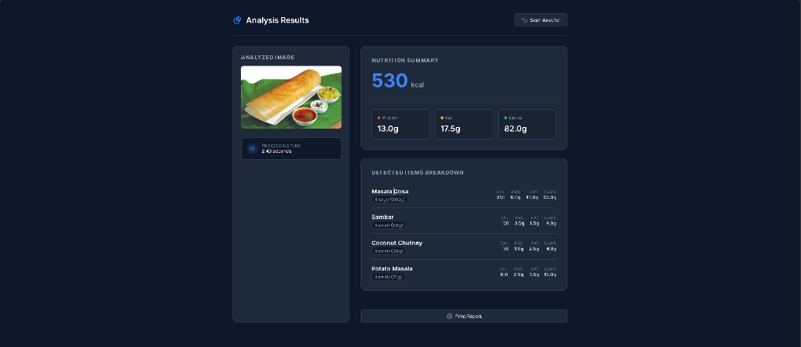

# AI Nutrition Detection App

(AI-Based Food Nutrition Estimator)

**LINK:**
*(Add your deployed link here later!)*

## Overview
This project is an AI-based application that estimates food calories and nutrient composition (proteins, carbohydrates, fats, etc.) from images using advanced Chain-of-Thought reasoning.

## Features
- Image-based food analysis
- Accurate nutrient estimation using Groq AI (Llama 4 Vision)
- Simple and interactive interface
- Blazing fast performance

## 🛠️ Tech Stack
- Python
- flask
- python-dotenv
- HTML/CSS/JS

## Screenshots

## How to Run
1. Clone the repository
2. Install dependencies: `pip install -r requirements.txt`
3. Add your Groq API key to a `.env` file (`GROQ_API_KEY=your_key`)
4. Run the app: `python app.py`

## Future Improvements
- Add a user dashboard for tracking daily calories
- Expand dataset for multi-item complex meals
- Mobile-responsive UI improvements

## 👨‍💻 Author
Pratham Burud
